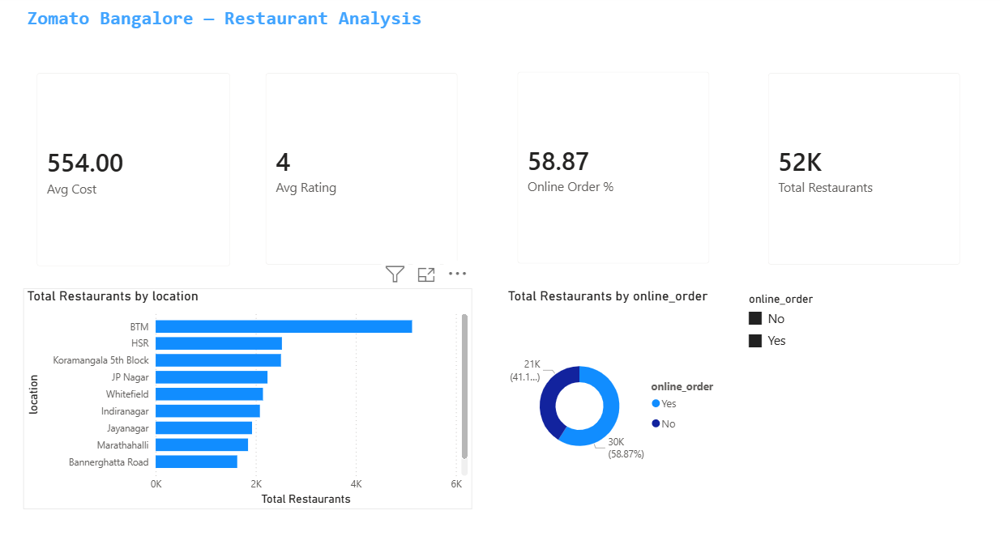
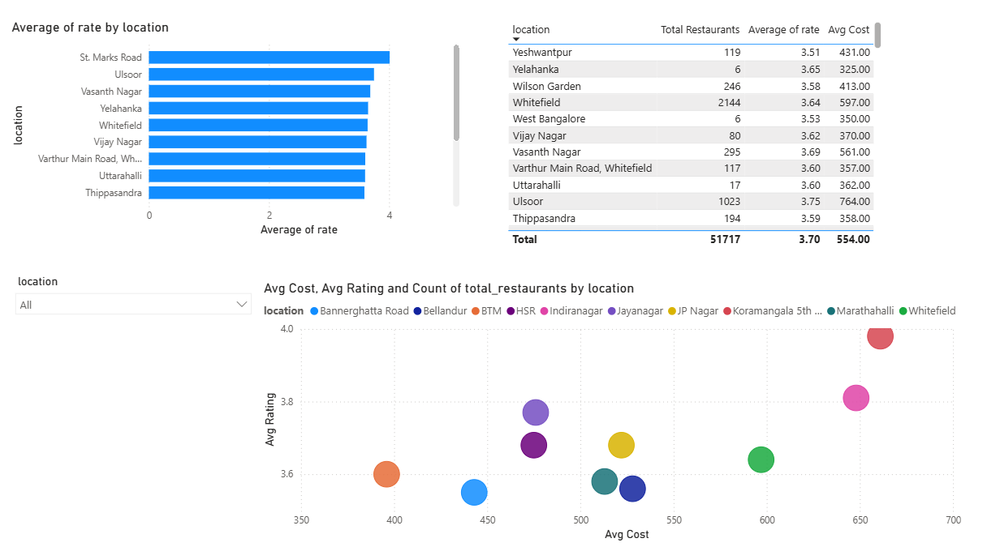
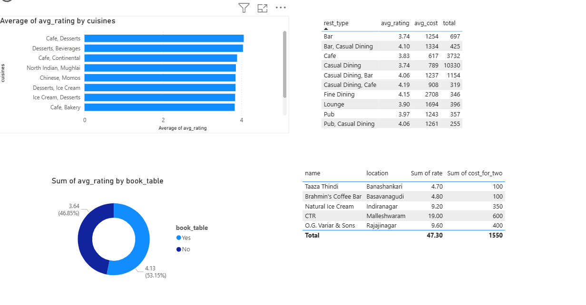

🍽️ Project 4: Zomato Bangalore Restaurant Performance Analysis

## 📌 Project Overview

This project analyses **51,717 restaurants** across Bangalore using the Zomato Bangalore dataset from Kaggle.
The goal is to uncover patterns in restaurant ratings, cuisine preferences, pricing, and location trends
using Python, SQL, and Power BI.

---

## 🛠️ Tech Stack

| Tool | Purpose |
|------|---------|
| Python (Pandas) | Data cleaning and analysis |
| Matplotlib & Seaborn | Data visualisation |
| SQL (SQLite + SQLAlchemy) | Querying and aggregating data |
| Power BI | Interactive dashboard |
| Jupyter Notebook | Step-by-step analysis environment |

---

## 📁 Folder Structure

```
zomato_analysis/
├── data/
│   ├── raw/                    # Original downloaded CSV (never edited)
│   └── cleaned/                # Cleaned CSV + 8 SQL result files
├── notebooks/
│   ├── 01_eda.ipynb            # Exploratory data analysis
│   ├── 02_cleaning.ipynb       # Data cleaning
│   ├── 03_analysis.ipynb       # Charts and visualisations
│   └── 04_sql.ipynb            # SQL queries using SQLite
├── sql/
│   └── queries.sql             # All 8 SQL queries
├── visuals/
│   └── charts/                 # 5 saved PNG charts
├── powerbi/
│   └── zomato_dashboard.pbix   # 3-page Power BI dashboard
└── README.md
```

---

## 📊 Dataset

- **Source:** [Kaggle — Zomato Bangalore Restaurants](https://www.kaggle.com/datasets/himanshupoddar/zomato-bangalore-restaurants)
- **Size:** 51,717 rows × 17 columns
- **Key columns:** name, location, rest_type, cuisines, rate, votes, cost_for_two, online_order, book_table

---

## 🔍 What I Did

### Notebook 1 — Exploratory Data Analysis
- Loaded the raw dataset
- Checked shape, column names, data types
- Identified missing values and messy columns
- Plotted top 10 restaurant types

### Notebook 2 — Data Cleaning
- Cleaned the `rate` column (removed "/5", converted to float)
- Cleaned the `cost_for_two` column (removed commas, converted to int)
- Dropped duplicate rows
- Renamed long column names for easier use
- Saved cleaned data to `data/cleaned/zomato_cleaned.csv`

### Notebook 3 — Analysis & Visualisation
- Online order vs dine-in comparison (pie + grouped bar chart)
- Average cost heatmap by location
- Rating vs cost scatter plot with trend line
- Top 15 cuisines by average rating
- Popularity (votes) vs rating scatter plot

### Notebook 4 — SQL Analysis
- Created a SQLite database from the cleaned CSV
- Wrote and ran 8 business questions as SQL queries
- Saved all query results as CSV files for Power BI

## 📊 Power BI Dashboard

### Dashboard Preview

**Page 1 — Overview**


**Page 2 — Location Analysis**


**Page 3 — Cuisine Performance**


## 💡 Key Findings

**Finding 1 — Online ordering restaurants are rated higher and cost less**
Restaurants that accept online orders have an average rating of 3.78 vs 3.65 for dine-in only,
and are cheaper on average (₹380 vs ₹550 for two people).

**Finding 2 — Price does not guarantee a better rating**
The scatter plot shows a weak positive relationship between cost and rating.
Many budget restaurants (₹200–400 for two) score above 4.0, proving that
value-for-money matters more than price in Bangalore's food scene.

**Finding 3 — Café and Continental cuisines outperform fast food in ratings**
Despite North Indian being the most common cuisine, Café-style and Continental
restaurants consistently score higher (avg 3.9–4.0 vs 3.6 for fast food chains).
Restaurants offering table booking score 0.37 rating points higher on average.

---

## 📈 Charts Produced

| Chart | File |
|-------|------|
| Top 10 restaurant types | `top_rest_types.png` |
| Rating distribution histogram | `rating_distribution.png` |
| Top 10 locations by count | `top_locations.png` |
| Online order analysis | `online_order_analysis.png` |
| Average cost heatmap by location | `cost_heatmap.png` |
| Rating vs cost scatter plot | `rating_vs_cost.png` |
| Top cuisines by rating | `top_cuisines_rating.png` |
| Popularity vs rating | `popularity_vs_rating.png` |

---

## 🧠 What I Learned

- How to clean real-world messy data using Pandas
- The difference between `mean` and `median` and when to use each
- How to use `GROUP BY`, `HAVING`, and `RANK()` in SQL
- How to connect a Python dataframe to a SQL database using SQLAlchemy
- How to build a multi-page interactive dashboard in Power BI
- How to tell a data story — from raw CSV to business insights

---

## 🚀 How to Run

```bash
# 1. Install dependencies
pip install pandas matplotlib seaborn jupyter sqlalchemy

# 2. Download dataset from Kaggle and place in data/raw/

# 3. Run notebooks in order
jupyter notebook notebooks/01_eda.ipynb
jupyter notebook notebooks/02_cleaning.ipynb
jupyter notebook notebooks/03_analysis.ipynb
jupyter notebook notebooks/04_sql.ipynb

# 4. Open Power BI dashboard
# powerbi/zomato_dashboard.pbix
```

---

*Project completed as part of Data Analytics learning journey — June 2026*
